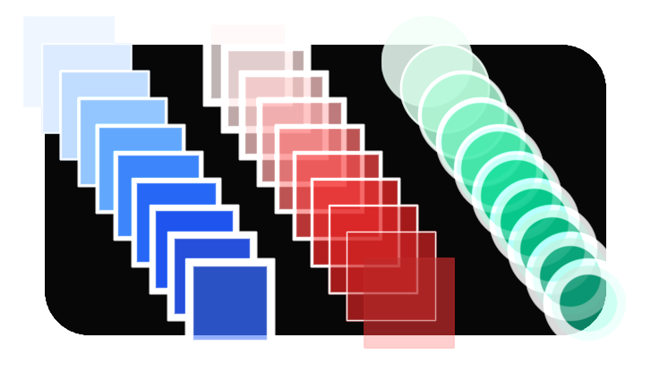

# Apos.Shapes
Shape rendering in MonoGame.

[](https://discord.gg/MonoGame)

## Description

This library draws shapes using [SDF](https://en.wikipedia.org/wiki/Signed_distance_function)s. Special thanks to [Inigo Quilez](https://iquilezles.org/) for doing a lot of the work on the math functions.



## Documentation

* Coming soon!

## Build

[](https://www.nuget.org/packages/Apos.Shapes/) [](https://www.nuget.org/packages/Apos.Shapes/)

## Features

* Circles
* Lines
* Rectangles
* Filled + Borders

## Usage samples

Install with:

```
dotnet add package Apos.Shapes
```

Add to your Game1.cs:

```csharp
using Apos.Shapes;

// ...

_graphics.GraphicsProfile = GraphicsProfile.HiDef;

// ...

ShapeBatch _sb = new ShapeBatch(GraphicsDevice, Content);

// ...

_sb.Begin();
_sb.BorderLine(new Vector2(100, 20), new Vector2(450, -15), 20, Color.White, 2f);

_sb.DrawCircle(new Vector2(120, 120), 75, new Color(96, 165, 250), new Color(191, 219, 254), 4f);
_sb.DrawCircle(new Vector2(120, 120), 30, Color.White, Color.Black, 20f);

_sb.DrawCircle(new Vector2(370, 120), 100, new Color(96, 165, 250), new Color(191, 219, 254), 4f);
_sb.DrawCircle(new Vector2(370, 120), 40, Color.White, Color.Black, 20f);

_sb.DrawCircle(new Vector2(190, 270), 10, Color.Black, Color.White, 2f);
_sb.DrawCircle(new Vector2(220, 270), 10, Color.Black, Color.White, 2f);

_sb.FillCircle(new Vector2(235, 400), 30, new Color(220, 38, 38));
_sb.FillRectangle(new Vector2(235, 370), new Vector2(135, 60), new Color(220, 38, 38));
_sb.FillCircle(new Vector2(235, 400), 20, Color.White);
_sb.FillRectangle(new Vector2(235, 380), new Vector2(125, 40), Color.White);
_sb.End();
```

## Other projects you might like

* [Apos.Gui](https://github.com/Apostolique/Apos.Gui) - UI library for MonoGame.
* [Apos.Input](https://github.com/Apostolique/Apos.Input) - Polling input library for MonoGame.
* [Apos.History](https://github.com/Apostolique/Apos.History) - A C# library that makes it easy to handle undo and redo.
* [Apos.Content](https://github.com/Apostolique/Apos.Content) - Content builder library for MonoGame.
* [Apos.Framework](https://github.com/Apostolique/Apos.Framework) - Game architecture for MonoGame.
* [AposGameStarter](https://github.com/Apostolique/AposGameStarter) - MonoGame project starter. Common files to help create a game faster.
