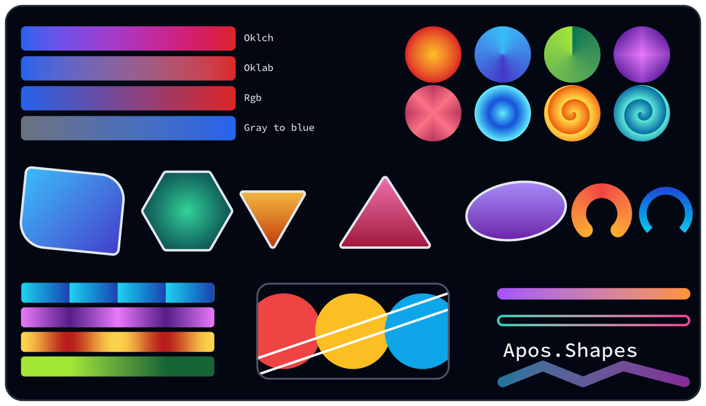

# Apos.Shapes
Shape rendering library for MonoGame and KNI.

[](https://discord.gg/MonoGame) [](https://www.nuget.org/packages/Apos.Shapes/) [](https://www.nuget.org/packages/Apos.Shapes/)

## Description

This library draws crisp anti-aliased shapes on the GPU using [SDF](https://en.wikipedia.org/wiki/Signed_distance_function)s. It also draws text with the [FontStashSharp](https://github.com/FontStashSharp/FontStashSharp) API and textures with the SpriteBatch API. Shapes, text, and textures can be interleaved in any order. Everything renders together in a single batch that never needs to break.

Special thanks to [Inigo Quilez](https://iquilezles.org/) for doing a lot of the work on the math functions.



## Features

* 10 shapes: Circle, Ellipse, Line, Path, Rectangle, Hexagon, Equilateral Triangle, Triangle, Arc, Ring
* `Fill`, `Border`, and `Draw` variants for every shape
* Paths draw a polyline as one continuous shape: translucent strokes blend once even where segments meet, with round, miter, or bevel joins and round, butt, or square caps, mixable within one path. Points come from an array or one at a time with `BeginPath`/`PathTo`/`EndPath`
* Rounded corners (per-corner radii on rectangles), rotation, and adjustable anti-aliasing
* Gradients: linear, radial, conical, spiral, and more, with repeat styles and Oklab / Oklch / RGB color interpolation
* Text (FontStashSharp API)
* Textures (SpriteBatch API)
* Clipping to a rectangle
* One batch for everything. Mixing shapes, text, and textures never breaks the batch
* Precompiled shader embedded in the assembly using [ShadowDusk](https://github.com/kaltinril/ShadowDusk). No need for Wine to build on Linux or OSX.
* Works with MonoGame 3.8.2+ and [KNI](https://github.com/kniengine/kni)

## Documentation

* [Getting started](https://apostolique.github.io/Apos.Shapes/getting-started/)
* [Shapes](https://apostolique.github.io/Apos.Shapes/shapes/)
* [Gradients](https://apostolique.github.io/Apos.Shapes/gradients/)
* [Clipping](https://apostolique.github.io/Apos.Shapes/clipping/)
* [Text](https://apostolique.github.io/Apos.Shapes/text/)
* [Textures](https://apostolique.github.io/Apos.Shapes/textures/)

You can also try the library directly in your browser [here](https://xnafiddle.net/#code=H4sIAAAAAAAAA41S20rEMBB9X9h_mMcUllAFXxQf9uINLIi66puk6Ww7GJOSpFtU_HebWrsXF3ZDoe3MnDNzTqZypHN4-HAe38-Gg6r9TUha48zC8xct-KUV71gb-7Yvz6-sKAuSri8cl8bxh0KUGGLDQVmliiRIJZyD5OOqAcIptK-v4QCa80cxwyVJTIQWOVp4zVfMoaqlnAgvC3h1aUsdwh39LzGL_jjD6RngHDTWu_swX5CLznageml31ixIYcOyFeHXNMPFGvbGJaZy-ESO0hbgbYVr-WfSman5WClTzx3ae3T0GUzbqPzutVnjUXrMwCzRWsoQloYyuNHkSSj63BKcCod8PXko4a0R2dRoj9pvWejSzryV_WzTxxF0yIO7zctMeGThwh6pWYO8-2g67wfPrKh3QldDb87HpwqFZVOjjOUTJeRb1C9PJ5FPMCfN_scvSakpWamQBQ-emoGMPWbHcTyCoziORnASB_2B-rkgj_8pLnTG1tervaNWRD_7yrfm-QEZrfGonQMAAA).

## Getting started

Install with:

```
dotnet add package Apos.Shapes
```

Set the `HiDef` profile in your game's constructor. (With KNI, use `FL10_0` instead.) Create a `ShapeBatch`, then draw between `Begin` and `End`:

```csharp
using Apos.Shapes;

public class Game1 : Game {
    GraphicsDeviceManager _graphics;
    ShapeBatch _sb;

    public Game1() {
        _graphics = new GraphicsDeviceManager(this);
        _graphics.GraphicsProfile = GraphicsProfile.HiDef;
    }

    protected override void LoadContent() {
        _sb = new ShapeBatch(GraphicsDevice);
    }

    protected override void Draw(GameTime gameTime) {
        GraphicsDevice.Clear(new Color(17, 24, 39));

        _sb.Begin();
        _sb.FillCircle(new Vector2(120, 120), 75, new Color(96, 165, 250));
        _sb.DrawRectangle(new Vector2(240, 70), new Vector2(150, 100), new Color(220, 38, 38), Color.White, 4f, 20f);
        _sb.BorderLine(new Vector2(120, 240), new Vector2(390, 240), 15, Color.White, 2f);
        _sb.End();

        base.Draw(gameTime);
    }
}
```

Read the [Getting started](https://apostolique.github.io/Apos.Shapes/getting-started/) guide for the full walkthrough.

## Other projects you might like

* [Apos.Gui](https://github.com/Apostolique/Apos.Gui) - UI library for MonoGame.
* [Apos.Input](https://github.com/Apostolique/Apos.Input) - Polling input library for MonoGame.
* [Apos.History](https://github.com/Apostolique/Apos.History) - A C# library that makes it easy to handle undo and redo.
* [Apos.Content](https://github.com/Apostolique/Apos.Content) - Content builder library for MonoGame.
* [Apos.Framework](https://github.com/Apostolique/Apos.Framework) - Game architecture for MonoGame.
* [AposGameStarter](https://github.com/Apostolique/AposGameStarter) - MonoGame project starter. Common files to help create a game faster.
