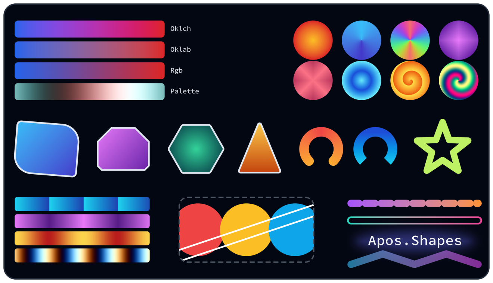

# Apos.Shapes
Shape rendering library for MonoGame and KNI.

[](https://discord.gg/MonoGame) [](https://www.nuget.org/packages/Apos.Shapes/) [](https://www.nuget.org/packages/Apos.Shapes/)

## Description

This library draws crisp anti-aliased shapes on the GPU using [SDF](https://en.wikipedia.org/wiki/Signed_distance_function)s. It also draws text straight from a font's outlines, SVG drawings straight from theirs, and textures with the `SpriteBatch` API. Shapes, text, drawings, and textures can be interleaved in any order. Everything renders together in a single batch that never needs to break.

Special thanks to [Inigo Quilez](https://iquilezles.org/) for doing a lot of the work on the math functions. The text follows Eric Lengyel's [Slug](https://sluglibrary.com) algorithm, by way of [Forme](https://github.com/AristurtleDev/Forme).



## Features

* 11 shapes: Circle, Ellipse, Line, Path, Rectangle, Chamfer, Hexagon, Equilateral Triangle, Triangle, Arc, Ring
* `Fill`, `Border`, and `Draw` variants for every shape
* Paths draw a polyline as one continuous shape, with round, miter, or bevel joins and round, butt, or square caps. Open or closed
* Rounded or chamfered corners, one per corner, plus rotation and adjustable anti-aliasing
* Dashed outlines and strokes, flat or round-capped, down to dotted lines
* Gradients: linear, radial, conical, spiral, and more, with repeat styles and Oklab / Oklch / RGB color interpolation. Shapes, text, and SVG drawings all take one
* Blurred shapes with a Gaussian edge, for drop shadows and glows
* `Measure` for every shape, giving the bounds it covers so a camera can cull it. No batch and no view needed
* Blue noise dithering so slow gradients don't band on 8-bit displays
* Text solved from the font's own outlines in the shader. No atlas, so nothing picks a size up front and a glyph stays exact at any size, rotation, and zoom
* SVG drawings solved the same way, fills and strokes, in the file's own colors and gradients or in one color of your own
* Textures (`SpriteBatch` API)
* Clipping to a rectangle
* One batch for everything. Mixing shapes, text, drawings, and textures never breaks the batch
* Precompiled shader embedded in the assembly using [ShadowDusk](https://github.com/kaltinril/ShadowDusk). No need for Wine to build on Linux or macOS.
* Works with MonoGame 3.8.2+ and [KNI](https://github.com/kniengine/kni)

## Documentation

* [Getting started](https://apostolique.github.io/Apos.Shapes/getting-started/)
* [Shapes](https://apostolique.github.io/Apos.Shapes/shapes/)
* [Dashes](https://apostolique.github.io/Apos.Shapes/dashes/)
* [Gradients](https://apostolique.github.io/Apos.Shapes/gradients/)
* [Blur](https://apostolique.github.io/Apos.Shapes/blur/)
* [Clipping](https://apostolique.github.io/Apos.Shapes/clipping/)
* [Text](https://apostolique.github.io/Apos.Shapes/text/)
* [SVG](https://apostolique.github.io/Apos.Shapes/svg/)
* [Textures](https://apostolique.github.io/Apos.Shapes/textures/)

You can also try the library directly in your browser [here](https://xnafiddle.net/#code=H4sIAAAAAAAAA41S20rEMBB9X9h_mMcUllAFXxQf9uINLIi66puk6Ww7GJOSpFtU_HebWrsXF3ZDoe3MnDNzTqZypHN4-HAe38-Gg6r9TUha48zC8xct-KUV71gb-7Yvz6-sKAuSri8cl8bxh0KUGGLDQVmliiRIJZyD5OOqAcIptK-v4QCa80cxwyVJTIQWOVp4zVfMoaqlnAgvC3h1aUsdwh39LzGL_jjD6RngHDTWu_swX5CLznageml31ixIYcOyFeHXNMPFGvbGJaZy-ESO0hbgbYVr-WfSman5WClTzx3ae3T0GUzbqPzutVnjUXrMwCzRWsoQloYyuNHkSSj63BKcCod8PXko4a0R2dRoj9pvWejSzryV_WzTxxF0yIO7zctMeGThwh6pWYO8-2g67wfPrKh3QldDb87HpwqFZVOjjOUTJeRb1C9PJ5FPMCfN_scvSakpWamQBQ-emoGMPWbHcTyCoziORnASB_2B-rkgj_8pLnTG1tervaNWRD_7yrfm-QEZrfGonQMAAA).

## Getting started

Install with:

```
dotnet add package Apos.Shapes
```

Set the `HiDef` profile in your game's constructor. (With KNI, use `FL10_0` instead.) Create a `ShapeBatch`, then draw between `Begin` and `End`:

```csharp
using Apos.Shapes;

public class Game1 : Game {
    GraphicsDeviceManager _graphics;
    ShapeBatch _sb;

    public Game1() {
        _graphics = new GraphicsDeviceManager(this);
        _graphics.GraphicsProfile = GraphicsProfile.HiDef;
    }

    protected override void LoadContent() {
        _sb = new ShapeBatch(GraphicsDevice);
    }

    protected override void Draw(GameTime gameTime) {
        GraphicsDevice.Clear(new Color(17, 24, 39));

        _sb.Begin();
        _sb.FillCircle(new Vector2(120, 120), 75, new Color(96, 165, 250));
        _sb.DrawRectangle(new Vector2(240, 70), new Vector2(150, 100), new Color(220, 38, 38), Color.White, 4f, 20f);
        _sb.BorderLine(new Vector2(120, 240), new Vector2(390, 240), 15, Color.White, 2f);
        _sb.End();

        base.Draw(gameTime);
    }
}
```

Read the [Getting started](https://apostolique.github.io/Apos.Shapes/getting-started/) guide for the full walkthrough.

## Other projects you might like

* [Apos.Gui](https://github.com/Apostolique/Apos.Gui) - UI library for MonoGame.
* [Apos.Input](https://github.com/Apostolique/Apos.Input) - Polling input library for MonoGame.
* [Apos.History](https://github.com/Apostolique/Apos.History) - A C# library that makes it easy to handle undo and redo.
* [Apos.Content](https://github.com/Apostolique/Apos.Content) - Content builder library for MonoGame.
* [Apos.Framework](https://github.com/Apostolique/Apos.Framework) - Game architecture for MonoGame.
* [AposGameStarter](https://github.com/Apostolique/AposGameStarter) - MonoGame project starter. Common files to help create a game faster.
