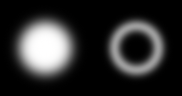
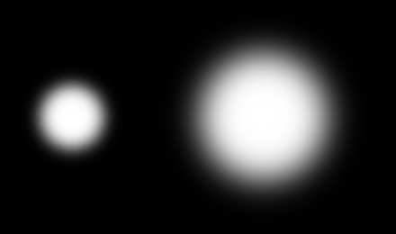
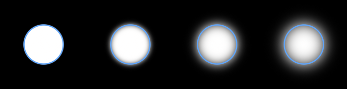

# Blur
This guide will show you how to draw shapes with a soft, blurred edge.

Every blurred shape has its own method. They take a flat `Color` and a `blur`, the standard deviation of the falloff, in world units:

```csharp
_sb.FillCircleBlurred(new Vector2(90, 95), 50, Color.White, 12f);
_sb.BorderCircleBlurred(new Vector2(270, 95), 50, Color.White, 8f, 14f);
```



There are eight: `FillCircleBlurred`, `FillEllipseBlurred`, `FillRectangleBlurred` and `FillLineBlurred`, and a `Border` version of each. They share the vertex buffer and the draw call with every other shape, so mixing shadows into a scene never splits the batch.

## Lines

A blurred line is a capsule with round ends. It also takes a radius per end, which gives the soft stroke a drawing tool wants: one call, swelling or tapering between the two circles it runs across.

```csharp
_sb.FillLineBlurred(new Vector2(30, 40), new Vector2(390, 40), 18f, Color.White, 5f);
_sb.FillLineBlurred(new Vector2(30, 120), new Vector2(390, 120), 22f, 3f, Color.White, 5f);
```


Paths are not in this family. A path is many quads that tile along the joints, and each one only knows its own segment, which is exactly what a blur cannot work with: it reaches far enough past an edge to need the whole shape at once. A stroke drawn as overlapping blurred lines doubles up wherever two of them cover the same pixel, and at a soft edge that shows. For a whole soft stroke, draw it into a `RenderTarget2D` and blur that instead.

## World units, not pixels

`aaSize` on the regular shapes is an anti-aliasing width, measured in screen pixels. It stays the same thickness however far you zoom, which is exactly what anti-aliasing should do.

A blur is not that. It belongs to the shape, so it is measured in world units and scales with the view. Both of these circles are the same call, drawn through a view scaled by 1 and by 2:

```csharp
_sb.Begin(Matrix.CreateTranslation(80, 130, 0));
_sb.FillCircleBlurred(Vector2.Zero, 34, Color.White, 9f);
_sb.End();

_sb.Begin(Matrix.CreateScale(2f) * Matrix.CreateTranslation(293, 130, 0));
_sb.FillCircleBlurred(Vector2.Zero, 34, Color.White, 9f);
_sb.End();
```



Zooming in on a blurred shape magnifies its blur along with it, the way zooming into a photograph magnifies everything in it. If you want a soft edge that stays a fixed number of pixels wide instead, that is `aaSize`, not this.

A blur under half a pixel can't be resolved, so it's raised to half a pixel and drawn as anti-aliasing. Blurred shapes never alias, however far out you zoom.

## The falloff is symmetric

The blur reaches equally to both sides of the edge, so a shape softens without growing. The 50% point stays exactly where the unblurred edge was. Each of these circles has a hairline outline drawn at the unblurred radius:

```csharp
foreach (float blur in new[] { 1f, 5f, 10f, 14f }) {
    _sb.FillCircleBlurred(center, 40, Color.White, blur);
    _sb.BorderCircle(center, 40, new Color(96, 165, 250), 1f);
}
```



The visible falloff extends about three times the blur past the edge in each direction. That is the distance to budget when you're deciding how much room a blurred shape needs.

## Drop shadows

The blur is a real Gaussian, so a blurred copy of a shape behind the shape itself is a drop shadow:

```csharp
_sb.FillRectangleBlurred(new Vector2(76, 55), new Vector2(180, 90), new Color(0, 0, 0, 115), 9f, new CornerRadii(18));
_sb.FillRectangle(new Vector2(70, 45), new Vector2(180, 90), new Color(37, 99, 235), new CornerRadii(18));
```


Draw the shadow first and offset it. The two calls are different kinds of shape, which doesn't break the batch.

## Outlines

The `Border` methods draw a band of the given thickness, measured inward from the edge, with nothing inside it. A band thinner than the blur smears into itself and dims, the way a real blur of a thin ring does:

```csharp
foreach (float thickness in new[] { 36f, 22f, 12f, 6f }) {
    _sb.BorderCircleBlurred(center, 45, Color.White, 6f, thickness);
}
```


If you want a blurred outline to stay at full strength, keep its thickness at or above about twice the blur.

A band only becomes a solid fill once its thickness clears the shape's inner radius by a few blur widths. At exactly the radius it does not: the band's inner edge has collapsed to a point at the center, and that point's own blur is still taken out of the middle.

## One color, fill or border

These methods take a `Color` rather than a `Gradient`, and fill and border are separate calls instead of one call that does both. Blurring a shape and blurring its silhouette are only the same operation while the color stays constant, and a gradient varies the color along the contour.

If you need a blurred gradient, you can draw the shapes into a `RenderTarget2D` and blur the target instead.

## Limits

The falloff is the exact blur of a straight edge, which is what almost every point on a contour is. A corner tighter than the blur is not: a real blur there depends on how much shape is nearby rather than on the distance to the edge alone, so tight corners come out slightly more solid than a true blur would give.

## Follow up

[Clipping](../clipping/README.md), a guide that shows how to clip drawing to a rectangle. Blurred shapes are clipped like any other, which is how you keep a shadow inside a panel.
