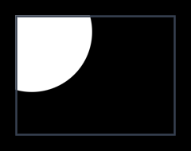
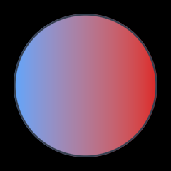
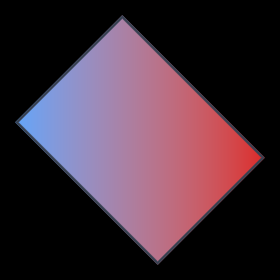
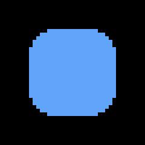

# Clipping
This guide will show you how to clip your draws to a rectangle.

Call `SetClipRect` to clip everything that gets drawn after it. Pass `null` to stop clipping. `RectangleF` comes from MonoGame.Extended:

```csharp
using MonoGame.Extended;
```

```csharp
_sb.Begin();

_sb.SetClipRect(new RectangleF(100, 100, 200, 150));
_sb.FillCircle(new Vector2(120, 120), 75, Color.White);
_sb.SetClipRect(null);

_sb.End();
```



The circle gets cut off at the edges of the clip rectangle. The outline shows where the clip rectangle is. Clipping is done on the GPU and doesn't break the batch. It applies to shapes, text, and textures alike.

The clip rectangle is independent from `Begin` and `End`. It stays active until you clear it with `null`.

## Rounded corners

The second parameter rounds the corners of the clip rectangle. Fully rounding a square clip gives a circle mask:

```csharp
_sb.SetClipRect(new RectangleF(100, 100, 200, 200), 100f);
```



## Rotation

The third parameter rotates the clip rectangle around its center. The angle is in radians.

```csharp
_sb.SetClipRect(new RectangleF(100, 100, 200, 150), 0f, MathF.PI / 4f);
```



## Anti-aliasing

The fourth parameter is the size of the anti-aliasing edge in pixels. The default is `1.5f` which matches the shapes. Set it to `0f` to get a hard scissor edge.

```csharp
_sb.SetClipRect(new RectangleF(100, 100, 200, 150), aaSize: 0f);
```

Both images are zoomed in. The first one uses the default anti-aliasing, the second one has it turned off:




## Follow up

[Text](../text/README.md), a guide that shows how to draw text with the ShapeBatch.
