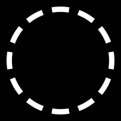
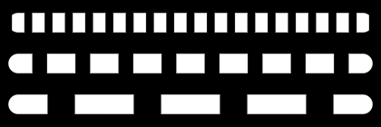
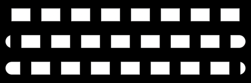
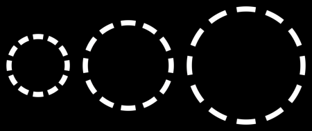
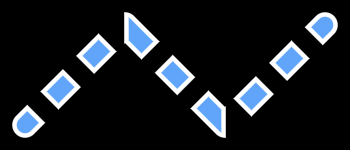
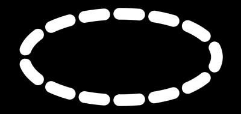

# Dashes
This guide will show you how to draw dashed outlines and dashed strokes.

Every `Draw` and `Border` method except the ellipse's takes a `dash` parameter. A `DashStyle` is defined by the length of a dash and the length of the space between dashes, both in world units:

```csharp
_sb.BorderCircle(new Vector2(120, 120), 75, Color.White, 6f, dash: new DashStyle(24f, 16f));
```



The default `DashStyle` draws solid, so shapes are undashed until you pass one. `DashStyle.None` is the same thing with a name.

Ellipses are the one shape that can't dash. Their perimeter has no closed form, so there is no length to lay a pattern along. Flatten an ellipse to a [closed path](#curves-and-ellipses) to dash it.

## Outlines and strokes

Dashes mean two different things depending on the shape.

Closed outlines (circle, rectangle, hexagon, equilateral triangle, and triangle) dash their **border** along the perimeter. The fill is left alone, so the gaps show whatever is inside:

```csharp
_sb.DrawCircle(new Vector2(120, 120), 75, new Color(96, 165, 250), Color.White, 8f, dash: new DashStyle(26f, 20f));
```


Strokes (line, path, arc, and ring) are cut into dashes along their centerline instead. Each dash comes out as its own little shape, with its own fill, its own border, and its own anti-aliased edges. This is why `Fill` also takes a `dash` on these four:

```csharp
_sb.DrawLine(new Vector2(20, 40), new Vector2(400, 40), 16, new Color(96, 165, 250), Color.White, 3f, dash: new DashStyle(34f, 24f));
```


## Size and spacing

`size` is the length of a dash and `spacing` is the length of the gap, both measured along the contour. Together they make one period of the pattern.

A `spacing` of 0 or less disables dashing, which is a convenient way to toggle a dash off without swapping the call.



```csharp
_sb.FillLine(new Vector2(20, 30), new Vector2(400, 30), 10, Color.White, dash: new DashStyle(12f, 10f));
_sb.FillLine(new Vector2(20, 75), new Vector2(400, 75), 10, Color.White, dash: new DashStyle(30f, 18f));
_sb.FillLine(new Vector2(20, 120), new Vector2(400, 120), 10, Color.White, dash: new DashStyle(60f, 30f));
```

## Offset

`offset` slides the pattern along the contour. It is measured in periods, so an offset of 1 is one full dash plus one full space and looks identical to an offset of 0. Animate it to get marching ants:

```csharp
_dashOffset += (float)gameTime.ElapsedGameTime.TotalSeconds * 0.5f;

_sb.FillLine(new Vector2(20, 30), new Vector2(400, 30), 10, Color.White, dash: new DashStyle(30f, 20f, _dashOffset));
```

The same line at offsets of 0, 0.33, and 0.66:



## Dash caps

`cap` picks the shape of each dash's ends, named like the line cap styles.

* `Butt` cuts each dash flat at both ends. This is the default.

  

* `Round` gives each dash a round cap. Where a round capped dash meets the round cap of a line or an arc, the two merge into one continuous shape.

  

With `Round` and a `size` of 0, each dash collapses to a single round cap and you get a dotted line:

```csharp
_sb.FillLine(new Vector2(20, 40), new Vector2(400, 40), 8, Color.White, dash: new DashStyle(0f, 34f, cap: DashCap.Round));
```


## Snapping

A pattern given in world units almost never divides evenly into a shape's perimeter. Left alone, the last repeat gets cut short: a closed outline shows a seam where the pattern wraps, and an open stroke ends on a stub. `snap` says how to resolve that by stretching the period slightly so the pattern fits.

* `Auto` uses `Tiling` on closed outlines and `EndToEnd` on open strokes. This is the default and it is usually what you want.

* `Off` uses the pattern exactly as given. The contour may end mid dash, and on a closed outline the leftover shows up as one gap that doesn't match the others. Here the circumference leaves a remainder, so the gap on the left is a quarter the width of the rest.

  

* `Tiling` scales the period so a whole number of repeats fits. Closed outlines wrap without a seam. Open strokes start on a dash and end on a space.

  

* `EndToEnd` scales the period so that a dash is centered on each end of the stroke, which puts a solid dash under both caps. On a closed outline there are no ends, so it falls back to `Tiling`. Both lines below have butt caps, `Off` on top and `EndToEnd` underneath:

  

Snapping only ever nudges the period, never the ratio between the dash and the gap. Because it fits a whole number of repeats, animating `size` or `spacing` pops when that number changes. Animate `offset` instead, keep `size + spacing` constant while trading length between them, use `Snap.Off` on open strokes if you need the lengths themselves to move smoothly, or use a counted pattern.

## Counted patterns

`DashStyle.FromCount` lays a whole number of repeats along the contour instead of measuring in world units. All three circles below carry exactly 12 dashes:

```csharp
_sb.BorderCircle(new Vector2(55, 95), 45, Color.White, 6f, dash: DashStyle.FromCount(12, 0.6f));
_sb.BorderCircle(new Vector2(185, 95), 65, Color.White, 6f, dash: DashStyle.FromCount(12, 0.6f));
_sb.BorderCircle(new Vector2(355, 95), 85, Color.White, 6f, dash: DashStyle.FromCount(12, 0.6f));
```



`count` is the number of dash + space repeats and `fill` is the fraction of each period the dash covers. The period is always the contour length divided by `count`, so there is no rounding to snap: closed outlines wrap seamlessly, a dash is centered on each end of an open stroke, and the dashes stretch continuously as the shape grows or shrinks. This is the style to use when the shape itself animates — a world unit pattern pops whenever the repeat count it snaps to changes, a counted one never does. `fill` animates smoothly too: at 1 it draws solid, and at 0 with `DashCap.Round` it collapses to dots.

## Corners and joints

The pattern walks the shape rather than the screen, so it rounds every corner it crosses. A dash that lands on a corner bends through it at full width, with its cut edges staying perpendicular to the direction of travel. The dash compresses on the inside of the bend and stretches on the outside, the way tape does when you wrap it around an edge.

```csharp
_sb.DrawPath([new Vector2(20, 130), new Vector2(120, 30), new Vector2(220, 130), new Vector2(320, 30)],
    12, new Color(96, 165, 250), Color.White, 3f, join: PathJoin.Miter, dash: new DashStyle(30f, 20f));
```



This holds for rounded rectangle corners, rounded hexagon and triangle corners, path joints, and the caps at the ends of a stroke. Miter and bevel tips appear once a dash covers the whole joint, and stay rounded off otherwise.

## Curves and ellipses

A closed path dashes seamlessly all the way around, which is also how you dash a shape the library can't walk. Flatten the curve (an ellipse, a bezier, anything you can sample) into points, pass them as a closed path, and it dashes like any other loop:

```csharp
Vector2[] points = new Vector2[96];
for (int i = 0; i < points.Length; i++) {
    float a = MathF.Tau * i / points.Length;
    points[i] = center + new Vector2(MathF.Cos(a) * 170f, MathF.Sin(a) * 60f);
}

_sb.FillPath(points, 12, Color.White, closed: true, dash: new DashStyle(40f, 26f, cap: DashCap.Round));
```



## Follow up

[Gradients](../gradients/README.md), a guide that shows how to fill shapes with gradients. A gradient spans the whole shape, so a dashed stroke picks up the colors it passes through instead of restarting on every dash.
