# Gradients
This guide will show you how to fill shapes with gradients.

Every shape method that takes a `Color` also takes a `Gradient`. A gradient is defined by two points that each have a color:

```csharp
_sb.FillCircle(new Vector2(200, 200), 100, new Gradient(
    new Vector2(100, 200), new Color(96, 165, 250),
    new Vector2(300, 200), new Color(220, 38, 38)));
```

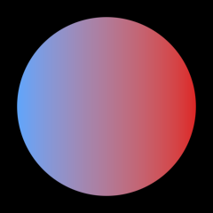

This draws a circle where the color transitions from blue at the left edge to red at the right edge. The fill and the border can each have their own gradient.

The colors are interpolated in the [Oklab](https://bottosson.github.io/posts/oklab/) color space by default. It avoids the muddy colors that you would get from interpolating in RGB.

Colors are not premultiplied. This matters for transparent colors since the gradient needs the full color values to interpolate correctly. For a transparent white, pass `new Color(255, 255, 255, 0)`.

## Color spaces

The `ColorSpace` property on the `ShapeBatch` selects the color space that the colors are interpolated in. It is captured per shape at draw time so it can change mid batch without breaking it:

```csharp
_sb.ColorSpace = ColorSpace.Oklch;
```

* `Oklab` interpolates in a straight line through Oklab. Distant hues pass through muted grays. This is the default.

  

* `Oklch` holds chroma while the hue takes the shortest path around the hue wheel. Vivid transitions.

  

* `Rgb` interpolates the raw sRGB channels.

  

Gray stops have no hue of their own. In Oklch they take the hue of the other stop so a gray to color gradient holds a steady hue. Texture and string masks are always multiplied in raw RGBA.

## Gradient shapes

The fifth parameter controls the shape of the gradient. The default is `Linear`.

```csharp
new Gradient(a, aColor, b, bColor, Gradient.Shape.Radial);
```

* `Linear` transitions along the line from the first point to the second point.

  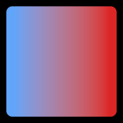

* `Radial` transitions in a circle around the first point. The second point sets the radius.

  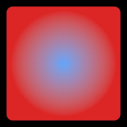

* `Bilinear` is like `Linear` but mirrored on both sides of the first point.

  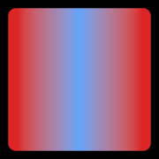

* `Conical` transitions with the angle around the first point and mirrors after half a turn. The second point sets the starting direction.

  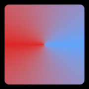

* `ConicalAsym` transitions with the angle around the first point over a full turn.

  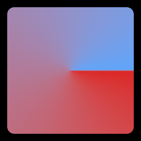

* `Square` transitions in a square around the first point.

  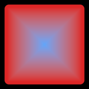

* `Cross` transitions in a cross around the first point.

  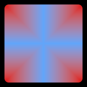

* `SpiralCW` winds clockwise around the first point, transitioning with both the angle and the distance. The second point sets the width of one winding.

  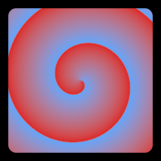

* `SpiralCCW` is like `SpiralCW` but winds counterclockwise.

  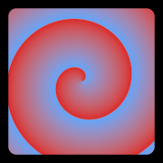

* `None` gives a solid color. This is what the implicit `Color` conversion uses.

  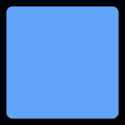

## Repeat styles

The sixth parameter controls what happens past the second point. The default is `None` which clamps to the second color.

```csharp
new Gradient(a, aColor, b, bColor, Gradient.Shape.Linear, Gradient.RepeatStyle.Triangle);
```

* `None` clamps to the second color.

  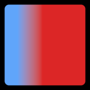

* `Sawtooth` restarts from the first color with a hard edge.

  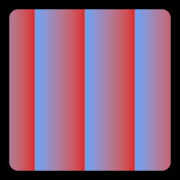

* `Triangle` bounces back and forth between the two colors.

  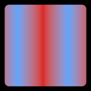

* `Sine` bounces back and forth with a smooth ease.

  

## Offsets

The offsets hold a color solid for a distance before it starts transitioning. They are given in world units. The first offset applies from the first point, the second offset applies from the second point.

```csharp
new Gradient(a, aColor, b, bColor, Gradient.Shape.Linear, Gradient.RepeatStyle.None, 20f, 20f);
```

The first bar has no offsets. The second bar has an offset of 100 on each side:

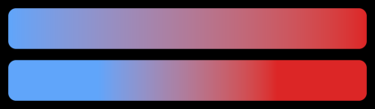

## Local space

By default, the gradient points are in world space. Set `isLocal` to true to give them relative to the shape instead. A local gradient moves and rotates along with its shape.

```csharp
_sb.FillCircle(new Vector2(200, 200), 100, new Gradient(
    new Vector2(-100, 0), new Color(96, 165, 250),
    new Vector2(100, 0), new Color(220, 38, 38), isLocal: true), rotation: MathF.PI / 4f);
```

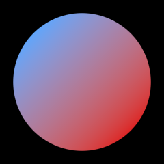

The local origin follows the shape:

* Circles, ellipses, hexagons, equilateral triangles, arcs and rings use their center.
* Rectangles use their top left corner.
* Lines and triangles use their first point, with the x axis pointing towards the second point.

## Banding

An 8-bit display steps each color channel in 256 increments. A gradient that transitions slower than one increment per pixel quantizes into visible bands with hard edges between them. The batch dithers every shape with half an increment of screen-space noise, which dissolves the bands into the true gradient. The noise pattern is static, so it looks the same whether a gradient moves across the screen or holds still.

The `DitherStrength` property scales the noise in 8-bit increments. The default of 1 covers exactly one quantization step, which removes the banding while staying imperceptible. Set it to 0 to turn the dither off:

```csharp
_sb.DitherStrength = 0f;
```


```csharp
_sb.DitherStrength = 1f;
```


Both images are contrast-stretched five times to make the comparison easy to see. At true contrast the bands are subtle and the noise is invisible. Banding shows the most on large, slow, dark gradients like night skies, glows, and vignettes.

## Dither noise

The `DitherNoiseSource` property selects the noise pattern. Both cost the same on the GPU:

* `BlueNoise` samples a 64x64 [blue noise](https://en.wikipedia.org/wiki/Colors_of_noise#Blue_noise) tile embedded in the library. Structureless grain with no pattern for the eye to lock onto. This is the default.

  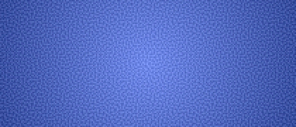

* `InterleavedGradient` computes [interleaved gradient noise](https://blog.demofox.org/2022/01/01/interleaved-gradient-noise-a-different-kind-of-low-discrepancy-sequence/) in the shader without touching a texture. It shows a faint diagonal weave. Use it if the texture path ever misbehaves on a platform.

  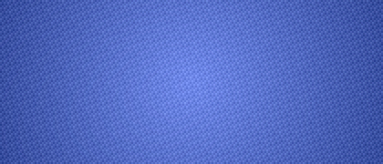

These two are rendered at strength 8 and zoomed in twice, on top of the same contrast stretch, to make the patterns visible. At the default strength both are imperceptible.

## Follow up

[Clipping](../clipping/README.md), a guide that shows how to clip your draws to a rectangle.
