# Gradients
This guide will show you how to fill shapes with gradients.

Every shape method that takes a `Color` also takes a `Gradient`. A gradient is defined by two points that each have a color:

```csharp
_sb.FillCircle(new Vector2(200, 200), 100, new Gradient(
    new Vector2(100, 200), new Color(96, 165, 250),
    new Vector2(300, 200), new Color(220, 38, 38)));
```

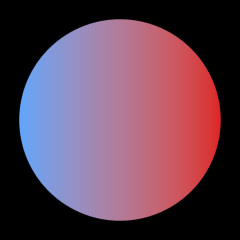

This draws a circle where the color transitions from blue at the left edge to red at the right edge. The fill and the border can each have their own gradient.

The colors are interpolated in the [Oklab](https://bottosson.github.io/posts/oklab/) color space by default. It avoids the muddy colors that you would get from interpolating in RGB.

Colors are not premultiplied. This matters for transparent colors since the gradient needs the full color values to interpolate correctly. For a transparent white, pass `new Color(255, 255, 255, 0)`.

## Color spaces

The `ColorSpace` property on the `ShapeBatch` selects the color space that the colors are interpolated in. It is captured per shape at draw time so it can change mid batch without breaking it:

```csharp
_sb.ColorSpace = ColorSpace.Oklch;
```

* `Oklab` interpolates in a straight line through Oklab. Distant hues pass through muted grays. This is the default.

  

* `Oklch` holds chroma while the hue takes the shortest path around the hue wheel. The transitions come out vivid.

  

* `Rgb` interpolates the raw sRGB channels.

  

Gray stops have no hue of their own. In Oklch they take the hue of the other stop so a gray to color gradient holds a steady hue. Texture and string masks are always multiplied in raw RGBA.

## Gradient shapes

The fifth parameter controls the shape of the gradient. The default is `Linear`.

```csharp
new Gradient(a, aColor, b, bColor, Gradient.Shape.Radial);
```

* `Linear` transitions along the line from the first point to the second point.

  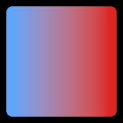

* `Radial` transitions in a circle around the first point. The second point sets the radius.

  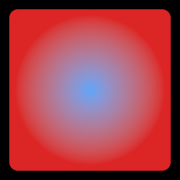

* `Bilinear` is like `Linear` but mirrored on both sides of the first point.

  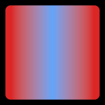

* `Conical` transitions with the angle around the first point and mirrors after half a turn. The second point sets the starting direction.

  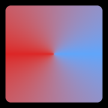

* `ConicalAsym` transitions with the angle around the first point over a full turn.

  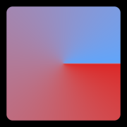

* `Square` transitions in a square around the first point.

  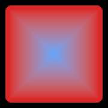

* `Cross` transitions in a cross around the first point.

  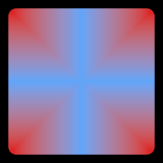

* `SpiralCW` winds clockwise around the first point, transitioning with both the angle and the distance. The second point sets the width of one winding.

  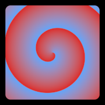

* `SpiralCCW` is like `SpiralCW` but winds counterclockwise.

  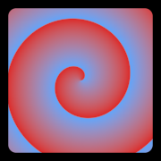

* `None` gives a solid color. This is what the implicit `Color` conversion uses.

  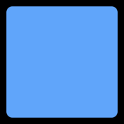

## Repeat styles

The sixth parameter controls what happens past the second point. The default is `None` which clamps to the second color.

```csharp
new Gradient(a, aColor, b, bColor, Gradient.Shape.Linear, Gradient.RepeatStyle.Triangle);
```

* `None` clamps to the second color.

  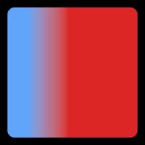

* `Sawtooth` restarts from the first color with a hard edge.

  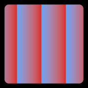

* `Triangle` bounces back and forth between the two colors.

  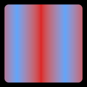

* `Sine` bounces back and forth with a smooth ease.

  

## Offsets

The offsets hold a color solid for a distance before it starts transitioning. They are given in world units. The first offset applies from the first point, the second offset applies from the second point.

```csharp
new Gradient(a, aColor, b, bColor, Gradient.Shape.Linear, Gradient.RepeatStyle.None, 20f, 20f);
```

The first bar has no offsets. The second bar has an offset of 100 on each side:

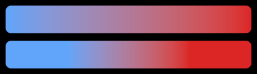

## Local space

By default, the gradient points are in world space. Set `isLocal` to true to give them relative to the shape instead. A local gradient moves and rotates along with its shape.

```csharp
_sb.FillCircle(new Vector2(200, 200), 100, new Gradient(
    new Vector2(-100, 0), new Color(96, 165, 250),
    new Vector2(100, 0), new Color(220, 38, 38), isLocal: true), rotation: MathF.PI / 4f);
```

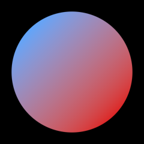

The local origin follows the shape:

* Circles, ellipses, hexagons, equilateral triangles, arcs and rings use their center.
* Rectangles use their top left corner.
* Lines and triangles use their first point, with the x axis pointing towards the second point.

## Palettes

A `Palette` colors a gradient from cosines instead of two stops. Each channel is `bias + amplitude * cos(tau * (frequency * t + phase))`, the construction from [Inigo Quilez's palette article](https://iquilezles.org/articles/palettes/), so one gradient can run through many colors:

```csharp
var rainbow = new Palette(
    new Vector3(0.5f), new Vector3(0.5f),
    new Vector3(1f), new Vector3(0f, 0.33f, 0.67f));
_sb.FillRectangle(new Vector2(20, 20), new Vector2(400, 40), new Gradient(
    new Vector2(20, 0), new Vector2(420, 0), rainbow));
```


The bias centers each channel's oscillation, the amplitude sets how far it swings, the frequency counts its cycles over the gradient, and the phase sets where in the cycle it starts. An `alpha` sets the opacity of the whole palette.

Frequencies snap to whole numbers, which is what lets a palette wrap onto itself: a `Sawtooth` repeat tiles with no seam.

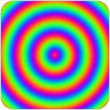

Only the colors change, so a palette takes every gradient shape, repeat style, offset, and local space, and the fill and border each take their own. The channels follow the `ColorSpace`: in `Rgb` they are the raw sRGB channels like the article, in `Oklab` the cosines swing lightness and the two color axes instead. Animating the phase slides every color along the palette for the cost of passing a different float.

The parameters quantize when the shape is drawn: bias and amplitude in steps of 1/127, phase in steps of 1/512 of a cycle, alpha in steps of 1/63, and frequencies to whole numbers from 0 to 15. Texture and string masks don't take palettes, and blurred shapes keep taking a flat color.

`Palette.FromStops` fits a palette through color stops when you'd rather pick colors than cosine parameters:

```csharp
var fitted = Palette.FromStops(ColorSpace.Oklab,
    (0f, new Color(251, 191, 36)), (0.5f, new Color(147, 51, 234)), (1f, new Color(8, 145, 178)));
```

Each channel picks the whole number frequency and the cosine that pass nearest the stops, weighted so the stops themselves count most. The fit is an approximation: one cosine can hit three stops exactly and runs close past more, but it can't hold flat or make a hard edge. A palette also always ends where it started, so stops whose two ends differ can't both land. Passing `mirrored: true` fits the stops into the front half of the palette and their reflection into the back half: aim the gradient across twice the distance you want and the shape runs through the stops once. Fit in the space you draw with, since the cosines run in the batch's `ColorSpace`. For exact colors at exact positions there's `ColorRamp` below; the fitted palette is the one that can animate.

## Ramps

A `Ramp` reshapes how a gradient travels between its colors. The gradient value runs through the curve first, so the stops land where the curve puts them instead of evenly. Stops are `(position, value)` pairs in [0, 1] with straight lines between them:

```csharp
_sb.FillRectangle(new Vector2(20, 20), new Vector2(400, 40), new Gradient(
    new Vector2(20, 0), new Color(96, 165, 250),
    new Vector2(420, 0), new Color(220, 38, 38),
    new Ramp((0f, 0f), (0.3f, 0f), (0.7f, 1f), (1f, 1f))));
```


This holds the first color for 30% of the run, fades across the middle, and holds the second color for the rest.

Two stops on the same position make a hard edge. The curve only ever lands on blends of the two stop colors though, so bands of many colors come from a `ColorRamp` below when you want exact colors at exact positions, or from a `Palette`, which colors whatever the curve picks. Here the `rainbow` from the last section, cut into quarters:

```csharp
_sb.FillRectangle(new Vector2(20, 20), new Vector2(400, 40), new Gradient(
    new Vector2(20, 0), new Vector2(420, 0), rainbow, new Ramp(
        (0f, 0f), (0.25f, 0f), (0.25f, 0.25f), (0.5f, 0.25f),
        (0.5f, 0.5f), (0.75f, 0.5f), (0.75f, 0.75f), (1f, 0.75f))));
```


The curve rides the gradient value, so a ramp takes every gradient shape, repeat style, offset, and local space, and the fill and border each take their own. Hard edges are antialiased like shape edges, and a `Sawtooth` repeat carries them cleanly across the seam.

Positions snap to a 256 step grid when the curve bakes, so a stop lands within 1/512 of where it was asked for. Each distinct curve takes a row of the batch's 256 row table, and when the table fills, the row that has gone longest undrawn recycles. Build ramps once where you can, though rebuilding one every frame works: going past 256 distinct curves in one batch makes the batch flush early to make room, which costs a draw call. Texture and string masks don't take ramps. On a ramped palette the phase quantizes in steps of 1/64 of a cycle instead of 1/512.

## Color ramps

A `ColorRamp` colors a gradient from `(position, color)` stops instead of two colors. Positions are in [0, 1] and the colors blend between them:

```csharp
var sunset = new ColorRamp(
    (0f, new Color(251, 191, 36)),
    (0.45f, new Color(236, 72, 153)),
    (0.7f, new Color(147, 51, 234)),
    (0.7f, new Color(45, 212, 191)),
    (1f, new Color(8, 145, 178)));
_sb.FillRectangle(new Vector2(20, 20), new Vector2(400, 40), new Gradient(
    new Vector2(20, 0), new Vector2(420, 0), sunset));
```


This blends amber through pink into purple, then cuts straight to teal at 70%.

Stops blend the way the two stop colors do: alpha weighted, in the batch's `ColorSpace`, with `Oklch` taking the short way around the hue wheel. Two stops on the same position make a hard edge, antialiased like a shape edge and exact at any zoom.

Only the colors change, so a color ramp takes every gradient shape, repeat style, offset, and local space, and the fill and border each take their own. A `Sawtooth` repeat carries the hard edges cleanly across the seam.

Positions snap to the same 256 step grid ramps use. Colors quantize to 8 bits per channel in the color space's own frame, and the batch's dither covers those steps like it covers the display's. Each color space you actually draw with bakes two rows of the batch's table. Texture and string masks don't take color ramps, and blurred shapes keep taking a flat color.

Rows recycle, so rebuilding the stops every frame animates a color ramp. That costs a bake per frame though, so sliding a palette's phase is still the cheaper animation.

## Banding

An 8-bit display steps each color channel in 256 increments. A gradient that transitions slower than one increment per pixel quantizes into visible bands with hard edges between them. The batch dithers every shape with half an increment of screen-space noise, which dissolves the bands into the true gradient. The noise pattern is static, so it looks the same whether a gradient moves across the screen or holds still.

The `DitherStrength` property scales the noise in 8-bit increments. The default of 1 covers exactly one quantization step, which removes the banding while staying imperceptible. Set it to 0 to turn the dither off:

```csharp
_sb.DitherStrength = 0f;
```


```csharp
_sb.DitherStrength = 1f;
```


Both images are contrast-stretched five times to make the comparison easy to see. At true contrast the bands are subtle and the noise is invisible. Banding shows the most on large, slow, dark gradients like night skies, glows, and vignettes.

## Dither noise

The `DitherNoiseSource` property selects the noise pattern. Both cost the same on the GPU:

* `BlueNoise` samples a 64x64 [blue noise](https://en.wikipedia.org/wiki/Colors_of_noise#Blue_noise) tile embedded in the library. The grain is structureless, with no pattern for the eye to lock onto. This is the default.

  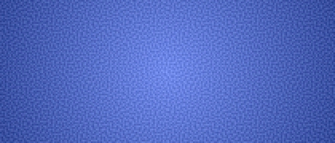

* `InterleavedGradient` computes [interleaved gradient noise](https://blog.demofox.org/2022/01/01/interleaved-gradient-noise-a-different-kind-of-low-discrepancy-sequence/) in the shader without touching a texture. It shows a faint diagonal weave. Use it if the texture path ever misbehaves on a platform.

  

These two are rendered at strength 8 and zoomed in twice, on top of the same contrast stretch, to make the patterns visible. At the default strength both are imperceptible.

## Follow up

[Blur](../blur/README.md), a guide that shows how to draw shapes with a soft edge. Blurred shapes take a flat color rather than a gradient.
