# Shapes
This page lists every shape that the ShapeBatch can draw. If you don't have a ShapeBatch set up yet, read the [Getting started](../getting-started/README.md) guide first.

## Naming convention

Every shape comes with three methods:

* `Fill` draws a shape without a border.

  

* `Border` draws a border without a fill. A border encases a shape without going outside its boundaries.

  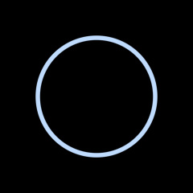

* `Draw` draws a shape with both a fill and a border.

  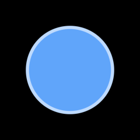

```csharp
_sb.FillCircle(new Vector2(120, 120), 75, new Color(96, 165, 250));
_sb.BorderCircle(new Vector2(120, 120), 75, new Color(191, 219, 254), 4f);
_sb.DrawCircle(new Vector2(120, 120), 75, new Color(96, 165, 250), new Color(191, 219, 254), 4f);
```

## Common parameters

* `thickness` is the size of the border in world units. The border grows inward from the shape's edge.
* `rounded` rounds the shape's corners. It is a distance in world units.
* `rotation` is an angle in radians. Shapes rotate around their own center.
* `aaSize` is the size of the anti-aliasing edge in pixels. The default is `1.5f`. Lower it to get a sharper edge, raise it to get a softer one.

Positions and sizes are in world units.

## Circle

A circle is defined by a center and a radius.

```csharp
_sb.FillCircle(new Vector2(120, 120), 75, Color.White);
```


## Ellipse

An ellipse is defined by a center, a horizontal radius, and a vertical radius.

```csharp
_sb.FillEllipse(new Vector2(120, 120), 100, 50, Color.White);
```

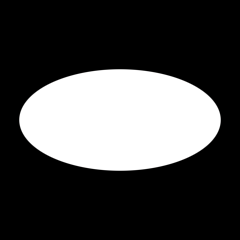

## Line

A line is defined by two points and a radius. The radius is half the line's thickness. The end caps are rounded. A line with the same start and end positions is drawn as a circle. To draw a line through more than two points, use a [Path](#path).

```csharp
_sb.FillLine(new Vector2(100, 20), new Vector2(450, 80), 20, Color.White);
```

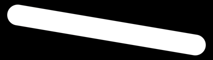

## Path

A path is a line that goes through any number of points. The whole path renders as one continuous shape: a translucent path blends once even where segments meet, and a gradient spans the full stroke instead of restarting on every segment.

```csharp
_sb.FillPath([new Vector2(100, 40), new Vector2(220, 140), new Vector2(340, 40), new Vector2(450, 120)], 20, Color.White);
```


Joins can be `Round`, `Miter`, or `Bevel`. Caps can be `Round`, `Butt` to stop at the endpoint, or `Square` to extend past it by the radius:

```csharp
_sb.FillPath([new Vector2(170, 75), new Vector2(205, 25), new Vector2(240, 75)], 12, Color.White, join: PathJoin.Miter, cap: PathCap.Butt);
```

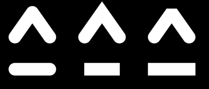

Styles can also be mixed inside one path. The two caps are set independently with `cap` and `capEnd`. For joins, pass a point together with a join style: that style applies to the joint at that point and to every following joint until another point sets a different one.

```csharp
_sb.FillPath([
    new Vector2(20, 130),
    (new Vector2(110, 40), PathJoin.Miter),
    new Vector2(200, 130),
    (new Vector2(290, 40), PathJoin.Bevel),
    new Vector2(380, 130)
], 14, Color.White, cap: PathCap.Butt, capEnd: PathCap.Square);
```

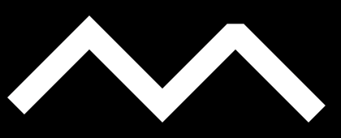

A path can also be built one point at a time instead of passing an array, which is handy inside a loop. Start it with `BeginPath`, `BeginFillPath`, or `BeginBorderPath`, feed points with `PathTo`, then draw it with `EndPath`. `PathTo` takes the same optional join style as a styled point:

```csharp
_sb.BeginFillPath(10, Color.White);
for (int i = 0; i <= 24; i++) {
    _sb.PathTo(new Vector2(20 + i * 15, 80 + MathF.Sin(i * 0.7f) * 50));
}
_sb.EndPath();
```

Miter joins sharper than the `miterLimit` parameter, measured like SVG's `miterlimit` with a default of 4, fall back to bevel. A path that crosses over itself overlaps like two separate shapes would. The same happens at a joint whose segments are shorter than the stroke is wide.

## Rectangle

A rectangle is defined by its top left corner and a size.

```csharp
_sb.FillRectangle(new Vector2(100, 100), new Vector2(200, 100), Color.White);
```

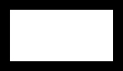

The corners can be rounded. Pass a single number to round every corner by the same amount:

```csharp
_sb.FillRectangle(new Vector2(100, 100), new Vector2(200, 100), Color.White, 10f);
```


Or pass a `CornerRadii` to control each corner. The order is top left, top right, bottom right, bottom left:

```csharp
_sb.FillRectangle(new Vector2(100, 100), new Vector2(200, 100), Color.White, new CornerRadii(10f, 20f, 30f, 40f));
```

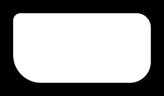

`CornerRadii` also has shorter constructors. With two numbers, the first one is used for the top left and bottom right corners, the second one for the top right and bottom left corners. The radii are clamped so that they never exceed half of the rectangle's smaller side.

## Hexagon

A hexagon is defined by a center and a radius. The top and bottom edges are flat. The radius is the distance from the center to the flat edges.

```csharp
_sb.FillHexagon(new Vector2(120, 120), 75, Color.White);
```

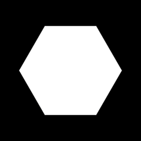

## Equilateral triangle

An equilateral triangle is defined by a center and a radius. The radius is the radius of the circle that fits inside the triangle. The triangle points down. Use the rotation to orient it in any direction.

```csharp
_sb.FillEquilateralTriangle(new Vector2(120, 120), 50, Color.White, rotation: MathF.PI);
```

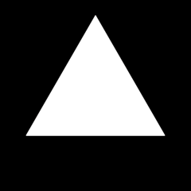

## Triangle

A triangle is defined by three points. The points can be given in any order.

```csharp
_sb.FillTriangle(new Vector2(100, 100), new Vector2(200, 100), new Vector2(150, 200), Color.White);
```

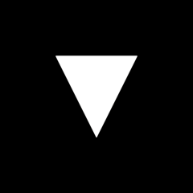

## Arc

An arc is a stroke that follows a circle. It is defined by a center, two angles, the radius of the circle, and the half thickness of the stroke. The angles are in radians. An angle of 0 points to the right and angles increase clockwise. The end caps are rounded.

```csharp
_sb.FillArc(new Vector2(120, 120), 0f, MathF.PI, 75, 10, Color.White);
```

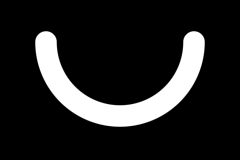

## Ring

A ring is the same as an arc except that the end caps are flat.

```csharp
_sb.FillRing(new Vector2(120, 120), 0f, MathF.PI, 75, 10, Color.White);
```

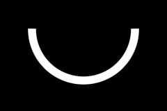

## Follow up

Anywhere a shape takes a `Color`, it can take a gradient instead. Read the [Gradients](../gradients/README.md) guide to learn how.
