# Shapes
This page lists every shape that the ShapeBatch can draw. If you don't have a ShapeBatch set up yet, read the [Getting started](../getting-started/README.md) guide first.

## Naming convention

Every shape comes with three methods:

* `Fill` draws a shape without a border.

  

* `Border` draws a border without a fill. A border encases a shape without going outside its boundaries.

  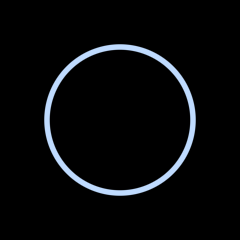

* `Draw` draws a shape with both a fill and a border.

  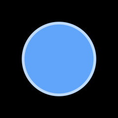

```csharp
_sb.FillCircle(new Vector2(120, 120), 75, new Color(96, 165, 250));
_sb.BorderCircle(new Vector2(120, 120), 75, new Color(191, 219, 254), 4f);
_sb.DrawCircle(new Vector2(120, 120), 75, new Color(96, 165, 250), new Color(191, 219, 254), 4f);
```

## Common parameters

* `thickness` is the size of the border in world units. The border grows inward from the shape's edge.
* `rounded` rounds the shape's corners. It is a distance in world units.
* `rotation` is an angle in radians. Shapes rotate around their own center.
* `aaSize` is the size of the anti-aliasing edge in pixels. The default is `1.5f`. Lower it to get a sharper edge, raise it to get a softer one.

Positions and sizes are in world units.

## Anti-aliasing

Shapes get a soft edge so they don't come out jagged. `AAStyle` picks which side of the boundary that edge sits on.

The default, `Outside`, keeps the whole fade past the boundary. Nothing fades into the shape, so colors come out as asked and two shapes sharing an edge meet with no seam between them. Leave it there for anything that moves or zooms.

`Centered` splits the fade across the boundary instead, so a shape covers exactly the pixels its size asks for. Put the shape on whole coordinates, pass an `aaSize` of `1f`, and its edges land on whole pixels:

```csharp
_sb.AAStyle = AAStyle.Centered;
_sb.BorderRectangle(new Vector2(40, 40), new Vector2(8, 8), Color.White, 1f, aaSize: 1f);
```

The same 8 by 8 square and 1 pixel border in every panel, zoomed way in. `Outside` at the default `aaSize`, then `Centered` at that same `aaSize`, then `Centered` at `1f`:

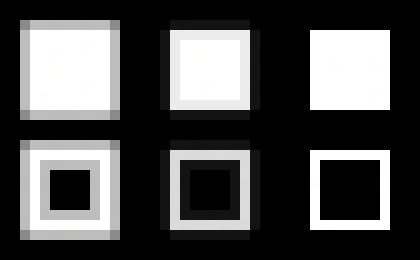

`Centered` only stays exact on the grid though. Two shapes meeting halfway between pixels leave a faint line where they touch, since half coverage over half coverage only comes to three quarters. Here the same two rectangles meet off the grid under `Outside`, then off the grid under `Centered`, then on the grid at an `aaSize` of `1f`:

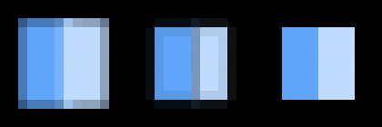

`AAStyle` is read per shape, so you can draw a `Centered` UI on top of an `Outside` scene without splitting the batch.

## Circle

A circle is defined by a center and a radius.

```csharp
_sb.FillCircle(new Vector2(120, 120), 75, Color.White);
```


## Ellipse

An ellipse is defined by a center, a horizontal radius, and a vertical radius.

```csharp
_sb.FillEllipse(new Vector2(120, 120), 100, 50, Color.White);
```

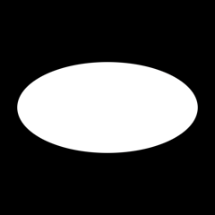

## Line

A line is defined by two points and a radius. The radius is half the line's thickness. The end caps are rounded. A line with the same start and end positions is drawn as a circle. To draw a line through more than two points, use a [Path](#path).

```csharp
_sb.FillLine(new Vector2(100, 20), new Vector2(450, 80), 20, Color.White);
```

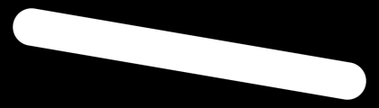

## Path

A path is a line that goes through any number of points. The whole path renders as one continuous shape: a translucent path blends once even where segments meet, and a gradient spans the full stroke instead of restarting on every segment.

```csharp
_sb.FillPath([new Vector2(100, 40), new Vector2(220, 140), new Vector2(340, 40), new Vector2(450, 120)], 20, Color.White);
```


Joins can be `Round`, `Miter`, or `Bevel`. Caps can be `Round`, `Butt` to stop at the endpoint, or `Square` to extend past it by the radius:

```csharp
_sb.FillPath([new Vector2(170, 75), new Vector2(205, 25), new Vector2(240, 75)], 12, Color.White, join: PathJoin.Miter, cap: PathCap.Butt);
```

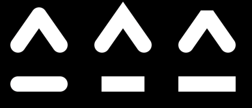

Styles can also be mixed inside one path. The two caps are set independently with `cap` and `capEnd`. For joins, pass a point together with a join style: that style applies to the joint at that point and to every following joint until another point sets a different one.

```csharp
_sb.FillPath([
    new Vector2(20, 130),
    (new Vector2(110, 40), PathJoin.Miter),
    new Vector2(200, 130),
    (new Vector2(290, 40), PathJoin.Bevel),
    new Vector2(380, 130)
], 14, Color.White, cap: PathCap.Butt, capEnd: PathCap.Square);
```

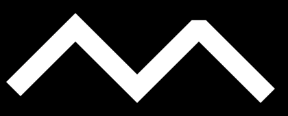

A path can also be built one point at a time instead of passing an array, which is handy inside a loop. Start it with `BeginPath`, `BeginFillPath`, or `BeginBorderPath`, feed points with `PathTo`, then draw it with `EndPath`. `PathTo` takes the same optional join style as a styled point:

```csharp
_sb.BeginFillPath(10, Color.White);
for (int i = 0; i <= 24; i++) {
    _sb.PathTo(new Vector2(20 + i * 15, 80 + MathF.Sin(i * 0.7f) * 50));
}
_sb.EndPath();
```

A path can also vary in width. Pass a radius per point instead of a single one and the stroke runs between each segment's two end circles, so it swells and tapers smoothly rather than stepping at every joint. This is what a pen's pressure gives you:

```csharp
Vector2[] points = new Vector2[25];
float[] radii = new float[25];
for (int i = 0; i < points.Length; i++) {
    points[i] = new Vector2(20 + i * 15, 80 + MathF.Sin(i * 0.7f) * 50);
    radii[i] = 2 + i * 0.7f;
}
_sb.FillPath(points, radii, Color.White);
```

`PathTo` takes a radius the same way, and one point carrying one switches the whole path over; the rest keep the radius `BeginPath` was given. Points that carry join styles take a radius list too, so a stroke can vary its width and its joins at once.

A stroke with a varying width dashes like any other path. The pattern still walks the spine, and each dash comes out as wide as the stroke is where it lands, caps included.

Miter joins sharper than the `miterLimit` parameter, measured like SVG's `miterlimit` with a default of 4, fall back to bevel. A path that crosses over itself overlaps like two separate shapes would. The same happens at a joint whose segments are shorter than the stroke is wide.

Pass `closed: true` to join the last point back to the first. The wrap is an ordinary joint rather than two caps, so it takes the same join styles and a translucent loop still blends exactly once all the way around. The `cap` parameters go unused. When the path is built one point at a time, finish it with `ClosePath()` instead of `EndPath()`:

```csharp
_sb.FillPath([new Vector2(120, 40), new Vector2(220, 130), new Vector2(20, 130)], 14, Color.White, join: PathJoin.Miter, closed: true);
```

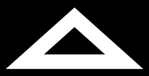

## Rectangle

A rectangle is defined by its top left corner and a size.

```csharp
_sb.FillRectangle(new Vector2(100, 100), new Vector2(200, 100), Color.White);
```

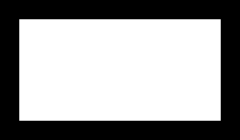

The corners can be rounded. Pass a single number to round every corner by the same amount:

```csharp
_sb.FillRectangle(new Vector2(100, 100), new Vector2(200, 100), Color.White, 10f);
```


Or pass a `CornerRadii` to control each corner. The order is top left, top right, bottom right, bottom left:

```csharp
_sb.FillRectangle(new Vector2(100, 100), new Vector2(200, 100), Color.White, new CornerRadii(10f, 20f, 30f, 40f));
```

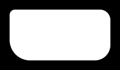

`CornerRadii` also has shorter constructors. With two numbers, the first one is used for the top left and bottom right corners, the second one for the top right and bottom left corners. The radii are clamped so that they never exceed half of the rectangle's smaller side.

## Hexagon

A hexagon is defined by a center and a radius. The top and bottom edges are flat. The radius is the distance from the center to the flat edges.

```csharp
_sb.FillHexagon(new Vector2(120, 120), 75, Color.White);
```

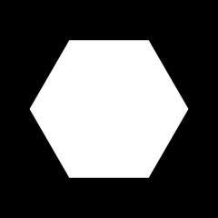

## Equilateral triangle

An equilateral triangle is defined by a center and a radius. The radius is the radius of the circle that fits inside the triangle. The triangle points down. Use the rotation to orient it in any direction.

```csharp
_sb.FillEquilateralTriangle(new Vector2(120, 120), 50, Color.White, rotation: MathF.PI);
```

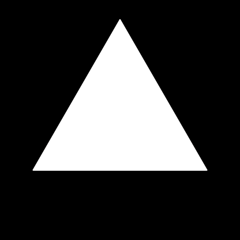

## Triangle

A triangle is defined by three points. The points can be given in any order.

```csharp
_sb.FillTriangle(new Vector2(100, 100), new Vector2(200, 100), new Vector2(150, 200), Color.White);
```

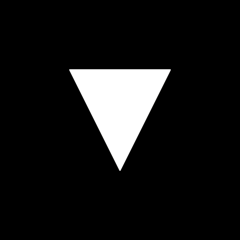

## Arc

An arc is a stroke that follows a circle. It is defined by a center, two angles, the radius of the circle, and the half thickness of the stroke. The angles are in radians. An angle of 0 points to the right and angles increase clockwise. The end caps are rounded.

```csharp
_sb.FillArc(new Vector2(120, 120), 0f, MathF.PI, 75, 10, Color.White);
```

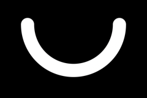

## Ring

A ring is the same as an arc except that the end caps are flat.

```csharp
_sb.FillRing(new Vector2(120, 120), 0f, MathF.PI, 75, 10, Color.White);
```

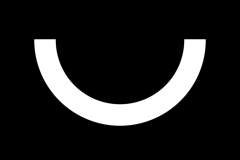

## Measuring a shape

The `Measure` class gives the rectangle a shape covers, in world units. Every method takes the same geometry its draw call takes, so `Measure.Circle` lines up with `DrawCircle`, `Measure.Path` with `DrawPath`, and so on.

```csharp
RectangleF bounds = Measure.Circle(new Vector2(120, 120), 75);
```

The main use is culling. A shape that doesn't touch the camera is a draw call you can skip:

```csharp
_sb.Begin(view);
foreach (Rock rock in rocks) {
    if (!Measure.Circle(rock.Position, rock.Radius).Intersects(cameraBounds)) continue;
    _sb.FillCircle(rock.Position, rock.Radius, rock.Color);
}
_sb.End();
```

There's no `ShapeBatch` and no view involved. These are the shape's own bounds, so they hold wherever it's drawn and at whatever zoom, and you can work them out once at load and put them in a quadtree.

A measure asks for geometry only. There's no `thickness`, because a border grows inward and a shape outlined is the same size as a shape filled. There's no `DashStyle` either: dashes only take pixels away, so the solid shape's rectangle still holds. Paths do take the join style and the miter limit, because a sharp miter runs a long way past the stroke.

What the rectangle leaves out is the anti-aliasing edge. That's `aaSize` pixels wide, 1.5 by default, so how far it reaches in world units depends on the zoom, which is exactly what a bound that travels with the shape can't depend on. It's under a pixel and a half either way, and smaller than any margin a camera wants. At a sharp corner it stretches: an offset of `aa` on both faces of a wedge moves the tip out by `aa` over the cosine of the half turn, so a spiky miter can carry several pixels of it.

The rectangle is tight for most shapes. Three cases leave more room. A bevel join, or a miter past its limit, reserves the corner the bevel cuts off. A butt cap reserves the round cap's radius past the end of a path. And a dashed shape is measured as the solid one, so every gap in the pattern is room the box keeps.

Blurred shapes measure with their own family: `Measure.CircleBlurred`, `Measure.EllipseBlurred`, `Measure.RectangleBlurred`, and `Measure.LineBlurred`. A blur is authored in world units and it reaches far, so unlike the anti-aliasing edge it does go in the box. See the [Blur](../blur/README.md) guide.

## Follow up

[Dashes](../dashes/README.md), a guide that shows how to dash any of these shapes.

Anywhere a shape takes a `Color`, it can take a gradient instead. Read the [Gradients](../gradients/README.md) guide to learn how.
