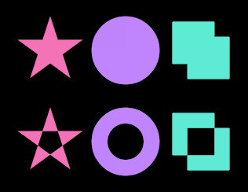
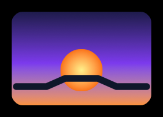

# SVG
This guide will show you how to draw SVG files with the `ShapeBatch`.

A drawing comes out of the file's own outlines. The pixel shader solves the curves that cross each pixel, the same way it solves a glyph, so a drawing is exact at whatever size and rotation it lands at. Nothing is rasterized up front, so there's no size to pick and no bitmap to go soft when you zoom. Drawings go into the same batch as the shapes and never break it.

## Load a drawing

A `ShapeSvg` is a document that has been read and flattened. Markup is a `string`, so a small drawing can live in your code:

```csharp
const string Icon = """
    <svg xmlns="http://www.w3.org/2000/svg" viewBox="0 0 64 64">
      <rect x="5" y="9" width="54" height="46" rx="8" fill="#0f172a" stroke="#38bdf8" stroke-width="4"/>
      <circle cx="21" cy="24" r="6" fill="#fbbf24"/>
      <path d="M9 51 L26 30 L38 44 L45 36 L57 51 Z" fill="#34d399"/>
    </svg>
    """;

protected override void LoadContent() {
    _sb = new ShapeBatch(GraphicsDevice);
    _icon = new ShapeSvg(Icon);
}

ShapeBatch _sb;
ShapeSvg _icon;
```

For a file on disk there are `byte[]` and `Stream` overloads. Put the `.svg` in your Content folder, make sure it gets copied to the output directory, and read it the way you'd read a font:

```csharp
using var file = TitleContainer.OpenStream($"{Content.RootDirectory}/icon.svg");
_icon = new ShapeSvg(file);
```

Parsing is the expensive part, so load a drawing once and keep it. One `ShapeSvg` can back any number of batches at the same time, and everything on it is safe to call from any thread.

A document this can't read throws at load. If it comes from somewhere you don't control, `ShapeSvg.TryLoad` asks instead of throwing:

```csharp
if (!ShapeSvg.TryLoad(bytes, out ShapeSvg? svg)) {
    // Not an SVG document this can read.
}
```

Curves are flattened at load. `tolerance` is how far one may stray from the shape the file describes, as a fraction of the viewBox diagonal, and it defaults to 0.001. Smaller follows the file more closely and costs more curves.

## Draw a drawing

`DrawSvg` goes between `Begin` and `End` like any other draw call:

```csharp
protected override void Draw(GameTime gameTime) {
    GraphicsDevice.Clear(Color.Black);

    _sb.Begin();
    _sb.FillCircle(new Vector2(100, 100), 56, new Color(37, 99, 235));
    _sb.DrawSvg(_icon, new Vector2(20, 20), 120f);
    _sb.End();

    base.Draw(gameTime);
}
```


Elements draw in the order the file lists them, which is what stacks the picture. Shapes, text, and drawings are drawn in the order you call them too, and it's still one draw call.

## The size is an em in world units

`size` is one em, and one em is the height of the viewBox. A 64 unit tall document drawn at 96 comes out 96 world units tall whatever the numbers inside it say:

```csharp
float x = 16f;
foreach (float size in new[] { 24f, 36f, 52f, 72f, 96f }) {
    _sb.DrawSvg(_icon, new Vector2(x, 112f - size), size);
    x += _icon.Measure(size).X + 14f;
}
```


Nothing was baked at any of those sizes. The 24 px copy and the 96 px copy solve the same curves, so zooming the view in draws the drawing bigger instead of blurring it.

## Where the drawing lands

`position` is the viewBox's top left corner. That's also the corner of the box `Measure` hands back, so you can place a drawing without having drawn it first:

```csharp
var at = new Vector2(20, 20);
_sb.DrawSvg(_icon, at, 96f);
_sb.BorderRectangle(at, _icon.Measure(96f), new Color(96, 165, 250), 1f);
```


The height of that box is the size you asked for and the width follows the document's aspect ratio, which is `Width / Height` on the `ShapeSvg` in the file's own units. It's the viewBox, so it's where the file says its picture is rather than a promise about the pixels. A file is allowed to draw outside its own viewBox and this doesn't clip, so ink can land past that box. `SetClipRect` is how you cut it.

`rotation` turns the whole drawing at once, around `position`, and `origin` moves the point it turns around, in world units out from the top left corner. So half of `Measure` turns a drawing around its middle. A turned drawing costs one sine and one cosine for the whole picture, however many elements it has, and `aaSize` is the same anti-aliasing width in screen pixels every shape takes.

## Fill rules

An outline that crosses itself needs a rule for what counts as inside. Nonzero fills wherever the outline wraps at all, even-odd only where it wraps an odd number of times, so the two disagree wherever a shape covers itself twice:

```csharp
const string Rules = """
    <svg xmlns="http://www.w3.org/2000/svg" viewBox="0 0 300 100">
      <path fill="#f472b6" d="M50 5 L76.5 86.4 L7.2 36.1 L92.8 36.1 L23.5 86.4 Z"/>
      <path fill="#c084fc" d="M150 50 m-45 0 a45 45 0 1 0 90 0 a45 45 0 1 0 -90 0 Z
                              M150 50 m-24 0 a24 24 0 1 0 48 0 a24 24 0 1 0 -48 0 Z"/>
      <path fill="#5eead4" d="M212 12 H268 V68 H212 Z M232 32 H288 V88 H232 Z"/>
    </svg>
    """;
```



Those three paths are a star drawn in one stroke of the pen, a disc with a second disc wound the same way inside it, and two overlapping squares. As written they come out like the top row. Put `fill-rule="evenodd"` on each of them and they come out like the bottom row, with the middles knocked out. The rule is per element and it's read from the file, so nothing about the draw call changes. Both are solved by the same pass, and a hole stays a hole at any size.

## The paint comes out of the file

Fills and strokes are taken as written, and so are `linearGradient` and `radialGradient` out of `defs`:

```csharp
const string Sunrise = """
    <svg xmlns="http://www.w3.org/2000/svg" viewBox="0 0 120 80">
      <defs>
        <linearGradient id="sky" gradientUnits="userSpaceOnUse" x1="0" y1="0" x2="0" y2="80">
          <stop offset="0" stop-color="#1e1b4b"/>
          <stop offset="0.55" stop-color="#7c3aed"/>
          <stop offset="1" stop-color="#fb923c"/>
        </linearGradient>
        <radialGradient id="sun">
          <stop offset="0" stop-color="#fef08a"/>
          <stop offset="1" stop-color="#f97316"/>
        </radialGradient>
      </defs>
      <rect x="0" y="0" width="120" height="80" rx="10" fill="url(#sky)"/>
      <circle cx="60" cy="50" r="18" fill="url(#sun)"/>
      <path d="M4 64 L30 64 L46 57 L74 57 L90 64 L116 64" fill="none" stroke="#0f172a"
            stroke-width="5" stroke-linecap="round" stroke-linejoin="round"/>
    </svg>
    """;

_sb.DrawSvg(_sunrise, new Vector2(20, 20), 160f);
```



A file gradient becomes a `Gradient` like the ones you write by hand, so it takes the batch's `ColorSpace` and its dithering. Two stops at the ends are a plain two stop gradient and anything else becomes a `ColorRamp`, which is how the three stop sky above keeps its middle color. `spreadMethod` maps onto the repeat styles: `pad` is `None`, `repeat` is `Sawtooth`, and `reflect` is `Triangle`. The gradient is part of the artwork, so it turns and scales with the drawing rather than staying put in the world.

Strokes go through the same path renderer `DrawPath` uses, with the caps, joins, miter limit and dashes the file asked for:

```csharp
const string Chart = """
    <svg xmlns="http://www.w3.org/2000/svg" viewBox="0 0 140 80">
      <path d="M10 70 H130" fill="none" stroke="#64748b" stroke-width="3"
            stroke-dasharray="10 7" stroke-dashoffset="4"/>
      <polyline points="10,58 34,24 58,46 82,14 106,40 130,10" fill="none" stroke="#22d3ee"
                stroke-width="6" stroke-linecap="round" stroke-linejoin="round"/>
      <circle cx="82" cy="14" r="7" fill="#0f172a" stroke="#22d3ee" stroke-width="4"/>
    </svg>
    """;

_sb.DrawSvg(_chart, new Vector2(20, 20), 160f);
```


The dash pattern is never refitted to the contour it runs along, so the file's own `stroke-dasharray` and `stroke-dashoffset` come out exactly as written.

## One color of your own

There's a second overload that takes a fill, and that fill replaces every paint in the file, strokes included:

```csharp
var ramp = new ColorRamp(
    (0f, new Color(96, 165, 250)),
    (0.5f, new Color(191, 219, 254)),
    (1f, new Color(220, 38, 38)));

_sb.DrawSvg(_chart, new Vector2(16, 16), 64f);
_sb.DrawSvg(_chart, new Vector2(144, 16), 64f, new Color(96, 165, 250));
_sb.DrawSvg(_chart, new Vector2(272, 16), 64f, new Gradient(
    new Vector2(272, 16), new Color(96, 165, 250),
    new Vector2(384, 16), new Color(220, 38, 38)));
_sb.DrawSvg(_chart, new Vector2(400, 16), 64f, new Gradient(
    new Vector2(400, 16), new Vector2(512, 16), ramp));
```


It's a `Gradient`, so a `Color` works as is and so do palettes, ramps, and color ramps. The gradient is resolved once for the whole drawing, which is why it runs across the picture above instead of restarting inside every element. A local gradient reads its two points in the drawing's own box, y down from `position`, and turns with the drawing.

What you get is a silhouette: the shape survives and the colors don't. That suits line art and icons made of separate marks. A drawing built on a filled backdrop comes out as that backdrop, since the backdrop is a paint like any other.

## What it reads

Elements: `path` with the whole path grammar including arcs, `rect` with `rx` and `ry`, `circle`, `ellipse`, `line`, `polyline`, `polygon`, and `g` and `a` around them. `transform` is applied at load and stacks down the tree.

Paint and stroke properties are read off the element or inherited from its group, and a declaration in `style=""` wins over the presentation attribute of the same name: `fill`, `stroke`, `fill-rule`, `fill-opacity`, `stroke-opacity`, `opacity`, `stroke-width`, `stroke-linecap`, `stroke-linejoin`, `stroke-miterlimit`, `stroke-dasharray`, `stroke-dashoffset`, and `color`. Opacity folds into the colors rather than compositing, so a translucent element blends against what's under it.

Colors can be `#rgb`, `#rgba`, `#rrggbb`, `#rrggbbaa`, `rgb()`, `rgba()`, `transparent`, `currentColor`, or any of the CSS color keywords. A `url(#id)` paint points at a gradient in `defs`, with the color written after it used when the reference misses. Gradients take `gradientUnits`, `gradientTransform`, `spreadMethod`, `href` chains between them, and `stop-color` with `stop-opacity`.

A drawing is read once when it loads, and its elements sit in the same table the glyphs use. Drawing it after that allocates nothing, however many elements it has.

## Limits

`use`, `text`, `clipPath`, `mask`, `filter`, `pattern`, and CSS `style` blocks are skipped. So is a nested `svg`, and a `switch` draws all of its children rather than the first one that fits. Anything skipped is dropped quietly, so a file that parses as XML always loads, and one full of things this doesn't draw loads to a drawing that's missing them.

There's no viewport clipping. A file that draws past its own viewBox draws past it here too.

A radial gradient with a focal point away from its center sweeps evenly from the center instead. `currentColor` is resolved at load and is black unless a `color` property set it, so it can't follow the color you draw with.

A `stroke-dasharray` of one or two lengths dashes exactly as written. A longer one has more than one dash length in it, which the dashes here can't do, so that stroke draws solid. A `stroke-linecap` of `square` gives a dashed stroke flat dash ends.

Opacity on a group multiplies into its children instead of compositing the group as a unit, since there's no offscreen pass to composite in. Children that overlap inside a translucent group show through each other.

An element wider or taller than about 2.4 times the viewBox height is dropped rather than drawn wrong. That's per element, not per document, so a long banner made of ordinary marks is fine.

A hand minified file sometimes uses an `xlink:href` without declaring the `xlink` prefix. That isn't well formed XML, so the load fails and `TryLoad` returns false. Adding `xmlns:xlink="http://www.w3.org/1999/xlink"` to the root element fixes the file.

## Follow up

[Textures](../textures/README.md), a guide that shows how to draw textures with the `ShapeBatch`.
