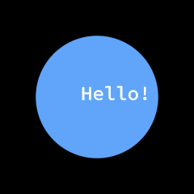
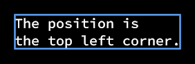
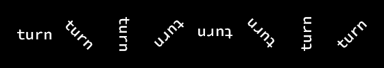
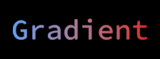

# Text
This guide will show you how to draw text with the `ShapeBatch`.

Text comes out of the font's own outlines. The pixel shader solves the curves that cross each pixel, the same way it solves a circle, so a glyph is exact at whatever size and rotation it lands at. There's no atlas behind it, so there's no size to pick up front and no charset to declare. Text goes into the same batch as the shapes and never breaks it.

## Load a font

Put a `.ttf` file in your Content folder and make sure it gets copied to the output directory. In your game's `LoadContent()`, read it into a `ShapeFont`:

```csharp
protected override void LoadContent() {
    _sb = new ShapeBatch(GraphicsDevice);

    using var ttf = TitleContainer.OpenStream($"{Content.RootDirectory}/my-font.ttf");
    _font = new ShapeFont(ttf);
}

ShapeBatch _sb;
ShapeFont _font;
```

There's a `byte[]` overload too. Reading the file is the expensive part, so load a font once and keep it. One `ShapeFont` can back any number of batches at the same time, and everything on it is safe to call from any thread. It's `IDisposable`, and a font you never dispose holds onto its file bytes for the life of the process.

A font this can't draw throws at load. If the bytes come from somewhere you don't control, `ShapeFont.TryLoad` asks instead of throwing:

```csharp
if (!ShapeFont.TryLoad(bytes, out ShapeFont? font)) {
    // Not a TrueType font this can read.
}
```

## Draw text

`DrawString` goes between `Begin` and `End` like any other draw call:

```csharp
protected override void Draw(GameTime gameTime) {
    GraphicsDevice.Clear(Color.Black);

    _sb.Begin();
    _sb.FillCircle(new Vector2(120, 120), 75, new Color(96, 165, 250));
    _sb.DrawString(_font, "Hello!", new Vector2(100, 100), 24f, Color.White);
    _sb.End();

    base.Draw(gameTime);
}
```



Shapes and text are drawn in the order you call them, and it's still one draw call. The fill is a `Gradient`, and a `Color` converts to one, so `Color.White` there is a gradient with one color in it. There's a `ReadOnlySpan<char>` overload for text you'd rather not build a string for.

Every glyph is read out of the file the first time something draws it. You never declare a character set, and the ones you stop drawing get recycled to make room for the ones you start. Once a glyph is resident, building its quad costs about 13% more than a circle's, and a line of text allocates nothing.

## The size is an em in world units

`size` is the em size, in the same world units the shapes use. Nothing was baked at any of these sizes. The 9 px copy and the 38 px copy read the same curves out of the same table:

```csharp
float x = 16f;
float baseline = 43f;
foreach (float size in new[] { 9f, 13f, 19f, 27f, 38f }) {
    _sb.DrawString(_font, "Shapes", new Vector2(x, baseline - _font.Ascent * size), size, Color.White);
    x += _font.MeasureString("Shapes", size).X + 14f;
}
```


Since the size is in world units, zooming the view in doesn't blur the letters, it draws them bigger. The curves are solved again every frame.

## Where the text lands

`position` is the top left corner of the first line, not the baseline. That's also the corner of the box `MeasureString` hands back, so you can measure a string and place it without having drawn it first:

```csharp
const string text = "The position is\nthe top left corner.";
var at = new Vector2(21f, 21f);

_sb.DrawString(_font, text, at, 20f, Color.White);
_sb.BorderRectangle(at, _font.MeasureString(text, 20f), new Color(96, 165, 250), 1f);
```



The box is the longest line's advance wide and the line count times `LineHeight` tall, so a one line string is one line tall whatever letters are in it. A `'\n'` starts a new line that far down, back at the left edge. A `'\r'` is skipped.

The metrics behind that are on the font, in em units, so multiply by the size you draw at: `Ascent` reaches above the baseline, `Descent` below it and is negative, `LineGap` is the extra room the font asks for between lines, and `LineHeight` is the three of them together. `Advance(codePoint)` and `Kerning(left, right)` give the same numbers the layout uses.

## Rotation and origin

`rotation` turns a whole line at once, around `position`. `origin` moves the point it turns around, in world units out from the top left corner, so half of `MeasureString` turns the text around its middle:

```csharp
Vector2 half = _font.MeasureString("turn", 22f) * 0.5f;
for (int i = 0; i < 8; i++) {
    _sb.DrawString(_font, "turn", new Vector2(50f + i * 66f, 50f), 22f, Color.White, MathF.Tau * i / 8f, half);
}
```



A turned line costs one sine and one cosine for the whole string, so it's the same price as a straight one. `aaSize` is there too, the same anti-aliasing width in screen pixels that every shape takes.

## The fill is a gradient

Text takes a `Gradient` where a shape takes one. Two stops sweep across the string:

```csharp
var at = new Vector2(16, 16);
float wide = _font.MeasureString("Gradient", 40f).X;
_sb.DrawString(_font, "Gradient", at, 40f, new Gradient(
    at, new Color(96, 165, 250),
    at + new Vector2(wide, 0f), new Color(220, 38, 38)));
```



The gradient is resolved once for the whole string rather than once per glyph, so the colors run across the line instead of starting over inside every letter. Everything in the [Gradients](../gradients/README.md) guide works here: the gradient shapes, the repeat styles, the offsets, the color spaces, palettes, ramps, and color ramps.

```csharp
var sunset = new ColorRamp(
    (0f, new Color(251, 191, 36)),
    (0.45f, new Color(236, 72, 153)),
    (0.7f, new Color(147, 51, 234)),
    (0.7f, new Color(45, 212, 191)),
    (1f, new Color(8, 145, 178)));

var at = new Vector2(16, 16);
float wide = _font.MeasureString("a color ramp", 40f).X;
_sb.DrawString(_font, "a color ramp", at, 40f, new Gradient(
    at, at + new Vector2(wide, 0f), sunset));
```


A local gradient reads its two points in the line's own box, the one `MeasureString` hands back, y down from `position`, and it turns with the text. A world one stays where it is while the text moves through it.

Alpha lives in the fill's colors, so translucent text is a fill whose colors are translucent. `new Color(255, 255, 255, 128)` draws a half transparent white line, and two stops with different alphas fade a line out along its length.

## Limits

Only TrueType outlines work. Most `.otf` files describe their glyphs with cubic curves in a `CFF` table instead, and this solver is quadratic only, so loading one throws a `NotSupportedException`. `TryLoad` is how you check without a `try`.

A newline is the only layout this does. There's no wrapping, no alignment, and no ellipsis, since those are decisions and this draws what it's handed. There's no fallback font chain either. A code point the font has no glyph for draws the font's own missing glyph box, so a hole shows up instead of quietly closing. You pick the font per call, so a fallback is a loop you write.

Each scanline through a glyph carries up to 16 curves. Almost nothing reaches that, though a handful of dense characters do. The shade blocks `░ ▒ ▓` (U+2591 to U+2593) are the loud case, since a row through one really does cross more than 16, and they come out with detail missing. Real text isn't affected.

On KNI's GL backends (WebGL, GLES, and desktop GL) the outlines are stored to within ~0.00003 em rather than exactly. It's a workaround for a bug in `nkast.Wasm.Canvas` that drops float texture uploads. An anti-aliased edge pixel there can land a shade off what the other backends give, which doesn't show at text sizes.

## Coming from FontStashSharp

The FontStashSharp API is gone and the dependency with it. A `FontSystem` plus `GetFont(size)` is one `ShapeFont` and a `size` argument on the call, and character spacing, line spacing, `TextStyle`, and `FontSystemEffect` have no replacement.

## Follow up

[SVG](../svg/README.md), a guide that shows how to draw SVG files with the `ShapeBatch`. A drawing is solved from its own outlines the way a glyph is.
